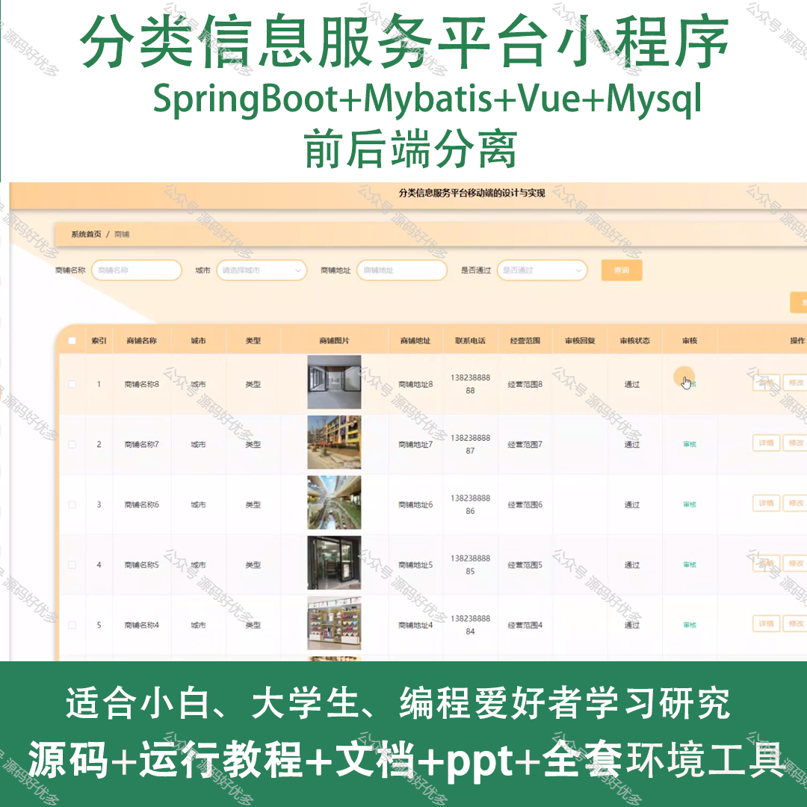
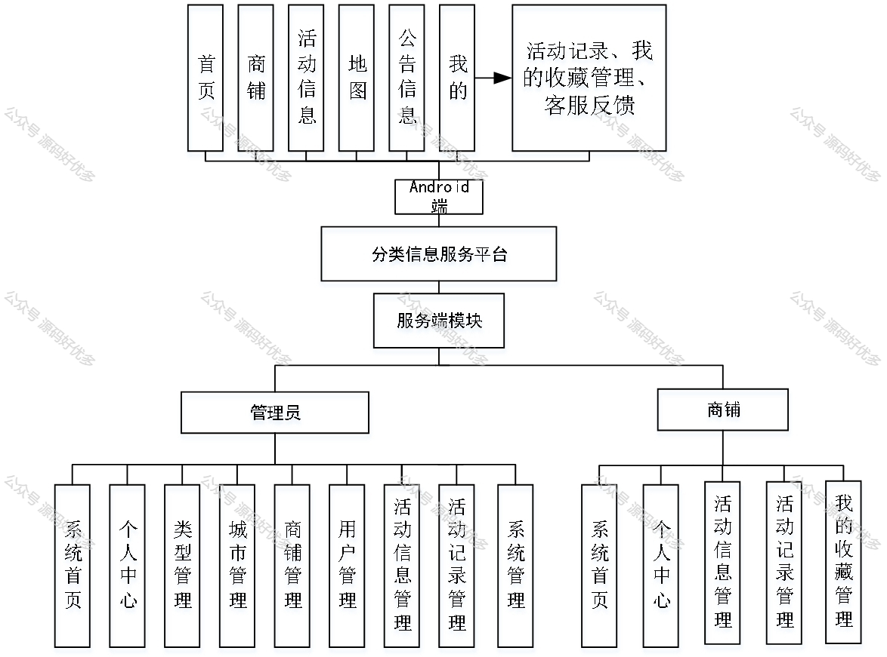
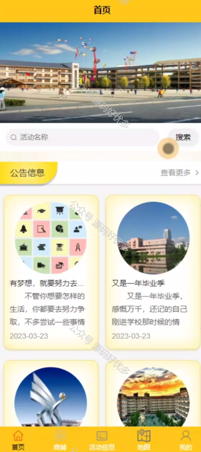
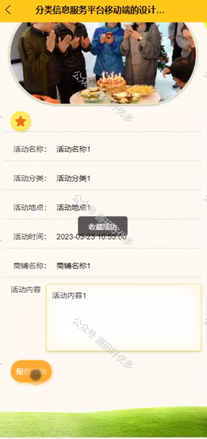
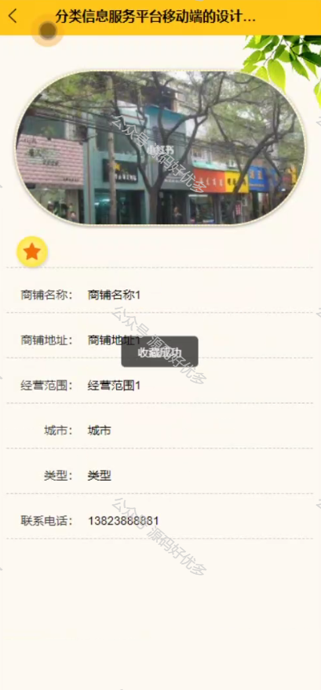
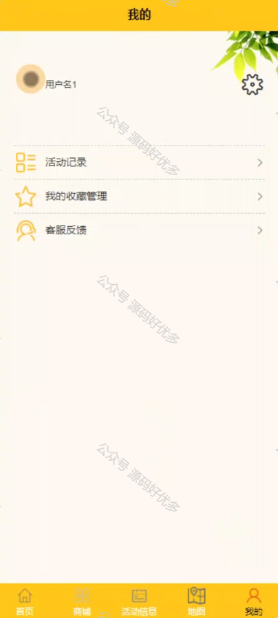
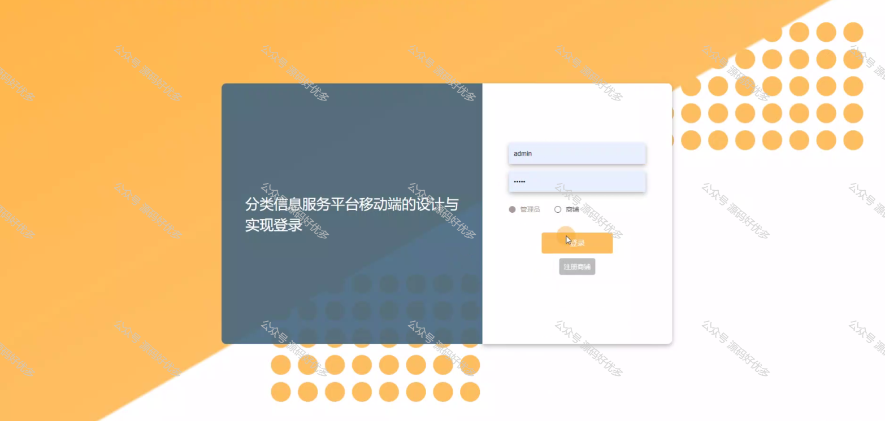
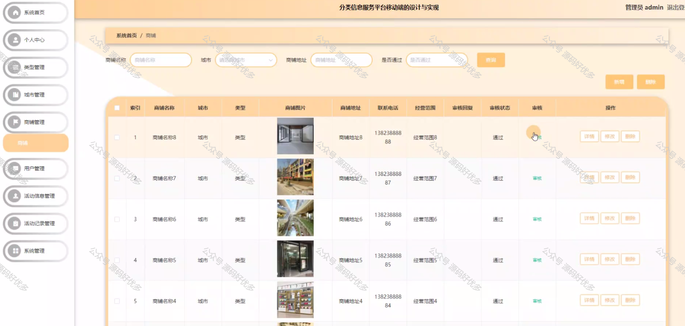
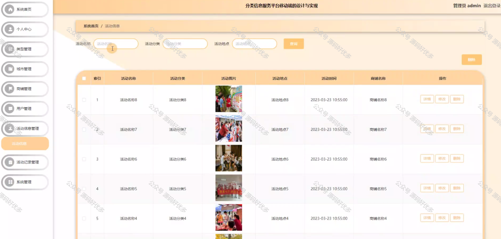
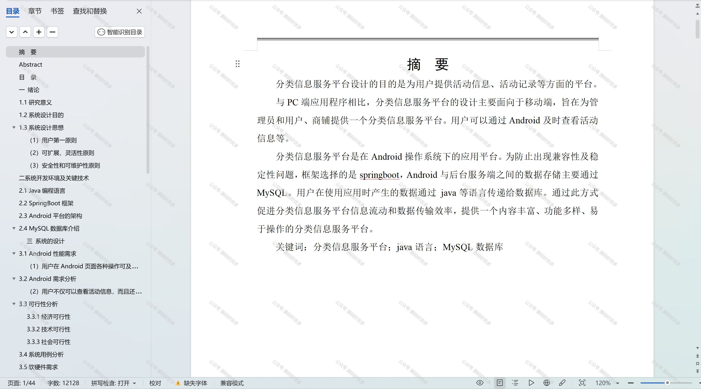

 
## 查看主页获取源码

> **作者介绍**： **✌**全网粉丝10W+本平台特邀作者、博客专家、CSDN新星计划导师、java领域优质创作者,博客之星、掘金/华为云/阿里云/InfoQ等平台优质作者、专注于项目实战 **✌**

  

### 一、作品包含

源码+数据库+设计文档万字+PPT+全套环境和工具资源+部署教程

### 二、项目技术

前端技术：Html、Css、Js、Vue、Element-ui

数据库：MySQL

后端技术：Java、Spring Boot、MyBatis

  

### 三、运行环境

开发工具：IDEA/eclipse + 微信开发者工具

数据库：MySQL5.7

数据库管理工具：Navicat10以上版本

环境配置软件： JDK1.8+Maven3.6.3

前端Nodejs：14

### 四、项目介绍
项目编号：mpweixinA023

分类信息服务平台微信小程序是一款集各类生活服务信息于一体的便捷工具，旨在为用户提供快速、精准的本地化服务，满足日常生活中的各种需求。小程序的微信生态优势，使得用户无需下载安装额外应用，即可在微信内一键访问，享受高效、便捷的服务体验。

前台用户功能：首页、商铺、活动信息、地图、公告信息、活动记录、我的收藏管理、客服反馈。

后台分为管理员和商铺
管理员的功能：系统首页、个人中心、类型管理、城市管理、商铺管理、用户管理、活动信息管理、活动记录管理、系统管理。
商铺的功能：系统首页、个人中心、活动信息管理、活动记录管理和我的收藏管理。

### 五、运行截图

  
